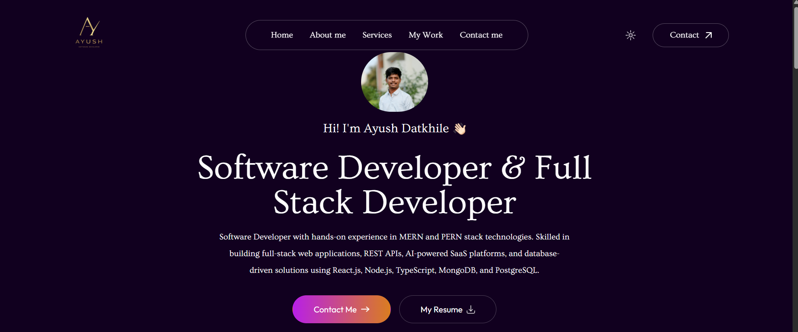

# 🚀 Ayush Datkhile | Software Developer Portfolio

<p align="center">
  
</p>

<p align="center">
  <a href="https://ayushdatkhile-dev.vercel.app/">
    
  </a>
  <a href="https://github.com/Ayush-Coder077">
    
  </a>
  <a href="https://www.linkedin.com/in/ayush-datkhile/">
    
  </a>
</p>

---

# 👋 About Me

Hi, I'm **Ayush Datkhile**.

I'm a **Software Developer** passionate about building scalable web applications, AI-powered SaaS products, backend systems, and modern full-stack applications.

I enjoy solving real-world problems using clean architecture, REST APIs, databases, authentication systems, and cloud services.

---

# ✨ Features

* ⚡ Built with Next.js
* 🎨 Modern UI/UX
* 🌙 Dark & Light Mode
* 📱 Fully Responsive
* 🚀 SEO Optimized
* ⚡ Fast Performance
* 🎞 Smooth Animations
* 💼 Project Showcase
* 📄 Resume Download
* 📧 Contact Form
* 🛡 Google reCAPTCHA Protection
* 📮 Formspree Integration
* 🔗 Social Links
* ☁️ Deployed on Vercel

---

# 🛠 Tech Stack

## Languages

<p>

</p>

## Frontend

<p>

</p>

## Tools

<p>

</p>

## Services & Integrations

<p>


</p>

---

# 🚀 Featured Projects

## 👕 Clothiq

A production-ready fashion e-commerce platform built with the MERN stack.

### Features

* Authentication & Authorization
* Admin Dashboard
* Shopping Cart
* Product Management
* Stripe Payment Gateway
* Cash on Delivery
* Cloudinary Image Upload
* Email Notifications
* Order Management
* Responsive Design

**Stack**

React • Node.js • Express • MongoDB • Stripe • Cloudinary • SendGrid

---

## 🤖 AdsAble.AI

A modern AI-powered SaaS application for generating advertisements.

### Features

* AI Advertisement Generation
* Clerk Authentication
* Credit System
* Subscription Management
* PostgreSQL Database
* Prisma ORM
* REST APIs
* Webhook Integration

**Stack**

TypeScript • React • Node.js • PostgreSQL • Prisma • Clerk • NeonDB

---

# 📂 Folder Structure

```text
portfolio
├── public
│   ├── assets
│   └── favicon.ico
│
├── src
│   ├── app
│   ├── components
│   ├── data
│   ├── styles
│   └── utils
│
├── package.json
└── README.md
```

---

# 🚀 Installation

Clone the repository

```bash
git clone https://github.com/Ayush-Coder077/portfolio.git
```

Go inside

```bash
cd portfolio
```

Install dependencies

```bash
npm install
```

Run locally

```bash
npm run dev
```

---

# 📚 Currently Learning

* AI Agents
* Agentic Workflows
* Docker
* AWS
* CI/CD
* System Design
* Microservices
* Advanced Next.js

---

# 💼 Open To Work

I'm actively looking for opportunities as:

* 💻 Software Developer
* ⚙️ Backend Developer
* 🌐 Full Stack Developer

I enjoy building scalable software, backend systems, APIs, SaaS applications, and AI-powered products.

---

# 📬 Contact

📧 **Email**

[datkhileayush@gmail.com](mailto:datkhileayush@gmail.com)

🌐 **Portfolio**

https://ayushdatkhile-dev.vercel.app/

💻 **GitHub**

https://github.com/Ayush-Coder077

💼 **LinkedIn**

https://linkedin.com/in/ayush-datkhile/

---

# ⭐ Support

If you like this project, please consider giving it a ⭐ on GitHub.

It motivates me to continue building high-quality software and open-source projects.

---

## ❤️ Thanks for visiting!

<p align="center">

Made with ❤️ using **Next.js**, **React.js**, and **Tailwind CSS**

</p>
